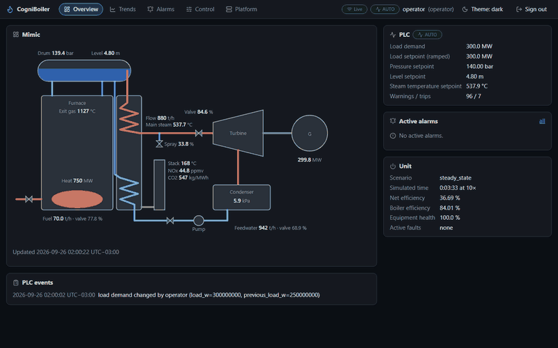
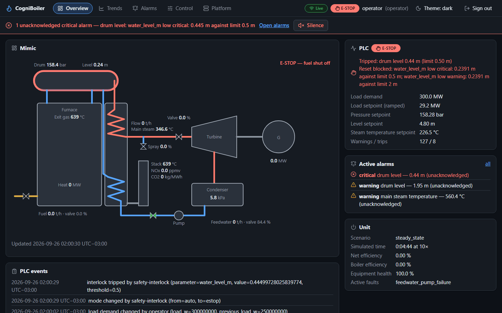
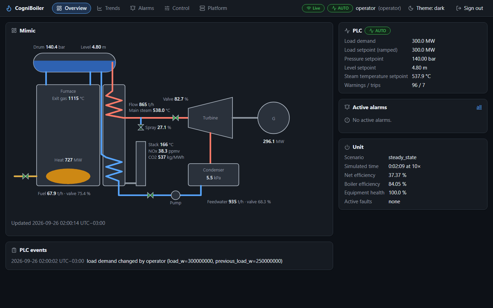
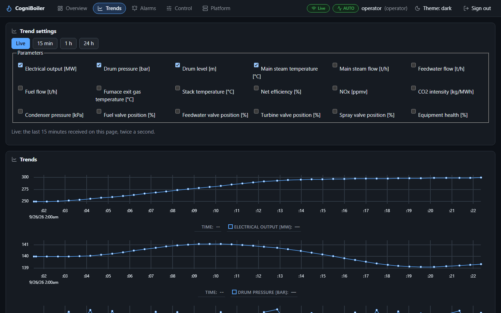
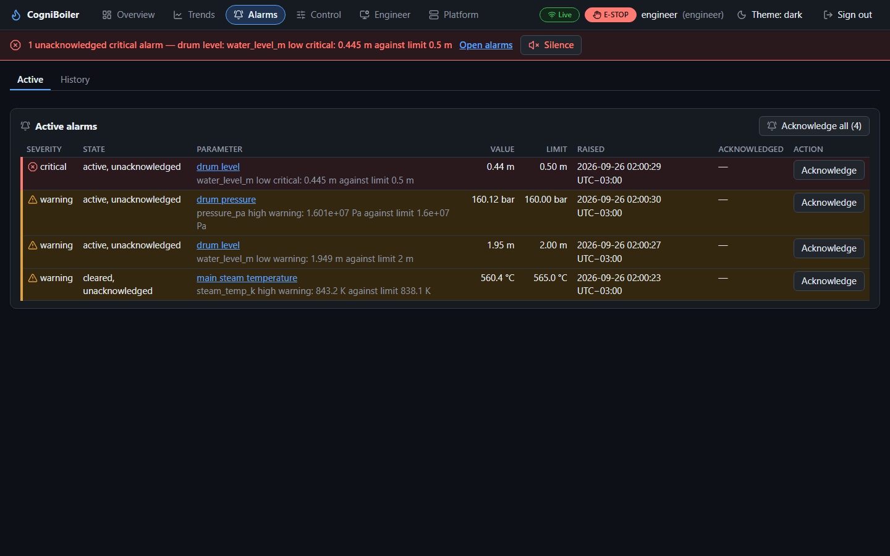
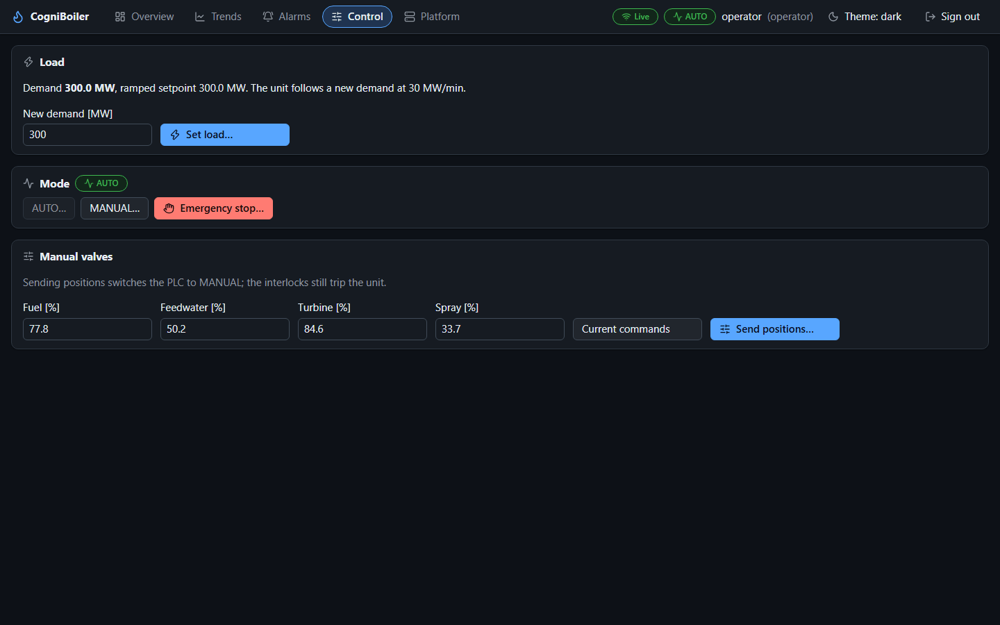
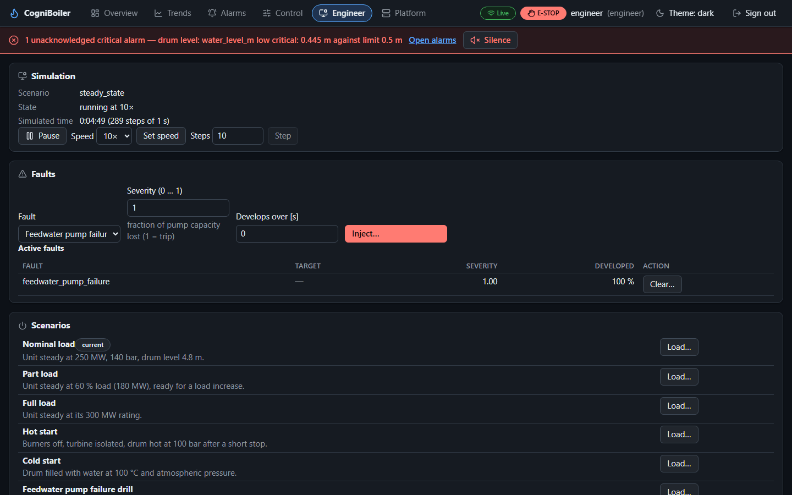
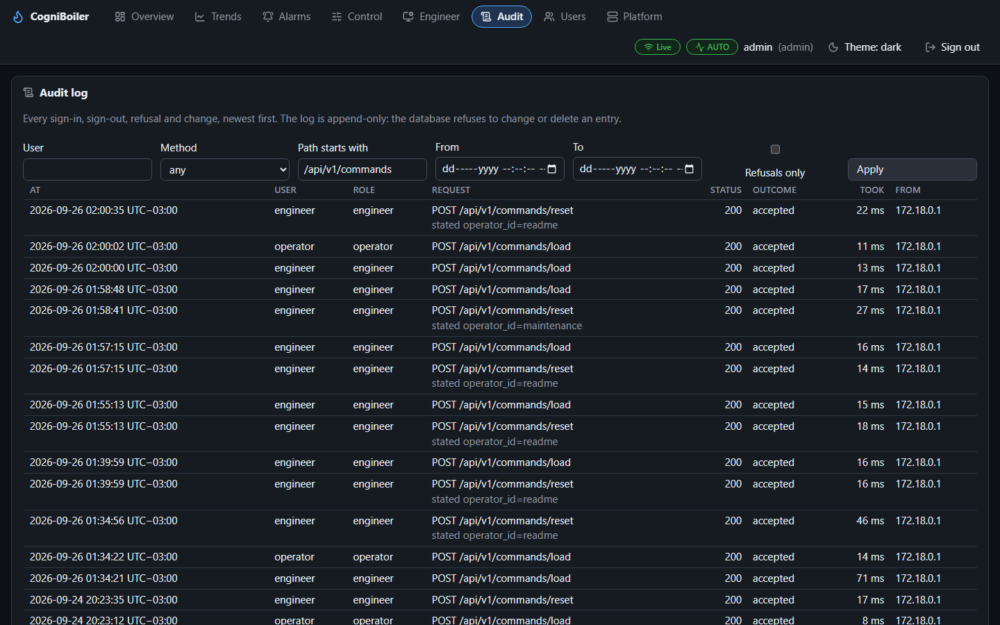
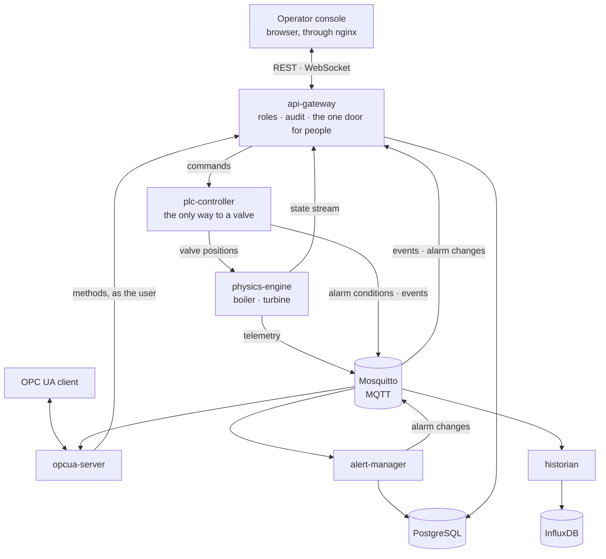

# CogniBoiler

**A digital twin of a 300 MW gas-fired steam unit — boiler, turbine and a virtual PLC — that
runs on one machine, is operated from a web console, and trips, alarms and recovers like the
real thing.**

[](https://github.com/dimbo1324/CogniBoiler/actions/workflows/ci.yml)




*The five-minute demo, as the operator sees it: the feedwater pump fails, the drum level
falls, the interlock shuts the fuel and a critical alarm flashes; the pump is repaired, an
engineer resets the trip and the unit ramps back to its load. Recorded from a running stack
by [`readme-media`](#development).*

---

- [What it is](#what-it-is) · [Run it](#run-it) · [The five-minute demo](#the-five-minute-demo)
  · [Screens](#screens) · [How it works](#how-it-works) · [Inside](#inside)
  · [Quality and security](#quality-and-security) · [Status and scope](#status-and-scope)
  · [Development](#development) · [Documentation](#documentation)

## What it is

- **A plant model** of a drum boiler and a steam turbine, built on energy and mass
  balances and IAPWS-97 steam tables: drum pressure, level and temperature, furnace,
  superheater, turbine and condenser, efficiency, heat rate, CO₂ and NOx, equipment wear.
  Six scenarios (steady, part and full load, hot and cold start, a pump drill) and six kinds
  of fault an engineer can inject: burner fouling, a steam leak, a feedwater pump failure,
  a stuck valve, a drifting and a failed instrument.
- **A virtual PLC that is the only way to a valve.** Coordinated control — the turbine on
  power, the boiler on pressure, three-element drum level, spray on steam temperature —
  AUTO, MANUAL and E-STOP, interlocks that trip the unit, and a trip that stays latched
  until an engineer resets it once its cause has cleared.
- **A platform around it,** as a plant has one: six Python services on MQTT, gRPC and
  OPC UA, a historian in InfluxDB, an alarm lifecycle in PostgreSQL, a gateway with
  sign-in, roles and an audit log nobody can edit, an operator console, Grafana dashboards
  and Prometheus metrics.
- **One command, one machine, no internet** once the images are built. Everything is
  Docker Compose.

It is a portfolio project: a working model of how plant software is put together, not a
control system for a real plant. An AI layer is planned and deliberately deferred — nothing
in the platform needs it ([status](#status-and-scope)).

## Run it

**You need** Git, [uv](https://docs.astral.sh/uv/) and Docker with Compose v2. uv installs
the pinned Python 3.14 by itself; Node.js is only needed to work on the console.

```bash
git clone https://github.com/dimbo1324/CogniBoiler.git && cd CogniBoiler
uv sync --all-packages                              # the Python environment, from uv.lock
python dev_tools_scripts_runner.py dev-secrets      # .env with generated local secrets
python dev_tools_scripts_runner.py stack up         # build, start, wait until healthy
python dev_tools_scripts_runner.py smoke            # end-to-end check through the gateway
```

On an empty Docker this took 4 min 34 s from `git clone` to a green `smoke`, most of it the
first image build; later starts take seconds.

| Open | Where |
|---|---|
| **Operator console** | http://localhost:8080 — or https://localhost:8443 with the self-signed certificate |
| API and its OpenAPI docs | http://localhost:8080/docs |
| Grafana | http://localhost:3000 — dashboards Process, Efficiency and emissions, Alarms, Platform |
| Prometheus | http://localhost:9090 |
| OPC UA | `opc.tcp://localhost:4840/cogniboiler` — anonymous read; methods as a signed-in user |

**Sign in** as `viewer`, `operator`, `engineer` or `admin`. Their passwords are the
`DEMO_*_PASSWORD` values `dev-secrets` wrote into `.env`; so are Grafana's, the broker's
and the databases'. Nothing in `.env` is ever committed.

Stop with `python dev_tools_scripts_runner.py stack down`. `backup` and `restore` save and
put back both databases; the [command reference](.ai/project/14-command-reference.md)
has every option.

## The five-minute demo

```bash
python dev_tools_scripts_runner.py demo
```

plays the scenario below through the gateway in about three and a half minutes — at ten
times real speed, the restart after the trip at three — while you watch the console, then
prints the audit log and fails if any service wrote an error line. It leaves the unit where
it found it: nominal load, no fault, real time.

| | What happens | Who does it | Where to look |
|---|---|---|---|
| 1 | The unit runs at 250 MW in AUTO | — | Overview: the mimic, the PLC panel |
| 2 | The load demand goes to 300 MW; the unit ramps at 30 MW/min | operator | Control → Load |
| 3 | The feedwater pump fails | engineer | Engineer → Faults |
| 4 | The drum level falls: a warning, then a critical alarm | — | the alarm banner, Alarms |
| 5 | The interlock shuts the fuel and latches E-STOP | the PLC | the red E-STOP badge |
| 6 | The operator acknowledges; the flashing and the horn stop | operator | Alarms → Acknowledge all |
| 7 | The pump is repaired and the drum refills | engineer | Engineer → Faults → Clear |
| 8 | The console says the cause has cleared; the engineer resets | engineer | Control → Emergency stop |
| 9 | The unit returns to AUTO and ramps back to its load | the PLC | Overview |
| 10 | Who did what, to the second | admin | Audit, filtered to `/api/v1/commands` |

To play it by hand, open the console in three windows — operator, engineer, admin — and set
the speed on the Engineer screen. Reset the trip at three times speed or slower: at ten, a
restart can trip the unit a second time on high steam temperature (a [known
gap](docs/architecture/overview.md#known-gaps)).



## Screens

| | |
|---|---|
|  |  |
| **Overview** — the mimic, the PLC mode and targets, standing alarms, the unit | **Trends** — any parameter, live or over 15 min to 24 h, with KPIs for the range |
|  |  |
| **Alarms** — the lifecycle, acknowledgement with a comment, history with filters | **Control** — load, mode, valves, setpoints; each command confirmed, each refusal explained |
|  |  |
| **Engineer** — speed, scenarios, faults and the log of what was done to the plant | **Audit** — every change and every refusal, with the user, the role and the outcome |

The console is dark by default — a control room is dim — and shows each screen only to the
roles allowed to use it: a viewer watches, an operator runs the unit, an engineer also sets
targets, resets trips and drives the simulation, an admin also reads the audit log and
manages users. The gateway enforces the same rules on every request.

## How it works



*The main paths. The gateway also reads history and KPIs from InfluxDB and the alarm
list from alert-manager over gRPC; Grafana reads InfluxDB and Prometheus.*

| Service | Owns | Speaks |
|---|---|---|
| `physics-engine` | the plant: the only writer of process state, one step per simulated second | gRPC `PhysicsService`, MQTT telemetry |
| `plc-controller` | control, interlocks, the E-Stop latch, alarm conditions | gRPC `PLCService`, MQTT alarms and events |
| `alert-manager` | the alarm lifecycle: raised, acknowledged, cleared, closed | gRPC `AlarmService`, MQTT alarm changes, PostgreSQL |
| `historian` | telemetry, KPIs, labels and events over time, retention, one-minute aggregates | MQTT in, InfluxDB out |
| `api-gateway` | users, sessions, roles, the audit log, the one door for people | REST, WebSocket, gRPC clients |
| `opcua-server` | an OPC UA view of the plant, the PLC and the alarms | OPC UA, MQTT in, the gateway for methods |
| `web` | the operator console | the gateway only, through nginx |

**Telemetry** goes up: every simulated second the physics engine publishes the plant on
MQTT; the historian records it, the OPC UA server projects it, and the gateway streams it to
the console over a WebSocket. **Commands** go down one path only: console → gateway (role
checked, audited) → PLC (validated, interlocks applied) → plant. Nothing reaches a valve
around the PLC: its gRPC port is not even published outside the Compose network.

The rules that must never break — one owner of process state, the PLC as the only way to
an actuator, interlocks no flag can disable, SI units and UTC milliseconds in every
contract, an append-only audit log, no secret in the repository — are written down in
[the invariants](docs/architecture/invariants.md) and held by tests.

## Inside

| Area | What is used, and for what |
|---|---|
| Services | Python 3.14 in one uv workspace; asyncio throughout, strict mypy |
| Plant model | NumPy, SciPy and IAPWS-97 steam properties |
| Contracts | Protocol Buffers and gRPC between services; MQTT (Mosquitto, a per-service account and ACL); an OpenAPI schema the console's types are generated from |
| Gateway | FastAPI, RS256 JWT access tokens with rotated refresh tokens, Argon2id passwords, SQLAlchemy and Alembic |
| Storage | PostgreSQL 16 (users, sessions, audit, alarms), InfluxDB 2 (time series) |
| Industrial edge | OPC UA with asyncua: `Basic256Sha256` signed and encrypted, or anonymous read |
| Console | React 19, TypeScript, Vite, TanStack Query, uPlot trends, Lucide icons |
| Observability | JSON logs with a correlation id across gRPC, Prometheus metrics, Grafana dashboards |
| Delivery | Docker Compose profiles, one image per service, GitHub Actions, images on GHCR |

## Quality and security

- **One quality gate** — `python dev_tools_scripts_runner.py quality-gate`, the same one CI
  runs: ruff, strict mypy, about 1 080 service tests (no broker, database or network
  needed), about 210 console tests, the contract checks (protobuf stubs, OpenAPI and the
  console's types, the agents' rules), the scripts' own tests and the console build.
- **CI starts the whole stack** on every push, runs `smoke` and 22 Playwright checks of
  the console — the demo among them, played by three users at once — and scans every image
  with Trivy; a separate job audits the locked dependencies.
- **Security that is part of the design:** every mutating request needs a role and writes
  an audit row the database will not let anyone update or delete; each service has its own
  broker account and database role; refresh tokens rotate and a replayed one closes the
  session; sign-in failures are throttled without telling whether the account exists;
  names reaching a time-series query are escaped where the query is built; secrets live
  only in `.env`, generated per machine.

## Status and scope

Version 1.0 is being finished: everything described above runs, and the remaining step is
the release itself. Built and working: the plant with its scenarios and faults, the PLC, the
alarms, the historian with retention and aggregates, the gateway, OPC UA, the console,
Grafana and Prometheus, backups, the scripted demo, and the delivery pipeline.

**Deliberately not there:**

- **AI.** Anomaly detection, efficiency advice and predictive maintenance are a later stage.
  The platform is built so it can be added without changing how the plant is controlled:
  the scenario and fault labels a model would learn from are already recorded, and names
  for its contracts are reserved. No service depends on it.
- **Kubernetes.** Compose on one machine is the target of 1.0; a Helm chart is optional
  and later.

Known gaps, each with its planned fix, are listed in
[the architecture overview](docs/architecture/overview.md#known-gaps).

## Development

Every routine job goes through one cross-platform script runner — the same for people, AI
assistants and CI:

```bash
python dev_tools_scripts_runner.py list             # the catalogue, with what each script does
python dev_tools_scripts_runner.py quality-gate     # everything CI checks; --quick before a push
python dev_tools_scripts_runner.py format-code      # ruff and Prettier
python dev_tools_scripts_runner.py console-e2e      # Playwright against the running stack
python dev_tools_scripts_runner.py readme-media     # this page's screenshots and GIF, from the stack
python dev_tools_scripts_runner.py doctor           # what this machine has and lacks
```

The console alone: `pnpm --dir apps/web install`, then `pnpm --dir apps/web dev` →
http://localhost:5173, proxied to the stack. A service alone, with the stack's
infrastructure: `stack up --infra-only`, then `uv run --package <service> python -m
<package>`.

## Documentation

- [Architecture overview](docs/architecture/overview.md) — what is built: services, MQTT
  topics, storage, the console, the pipeline, known gaps.
- [Service boundaries](docs/architecture/service-boundaries.md) — which service owns what.
- [Invariants](docs/architecture/invariants.md) — what must never break, and why.
- [Command reference](.ai/project/14-command-reference.md) — ports, running a service from
  the host, topics, platform notes.
- [AGENTS.md](AGENTS.md) and [CLAUDE.md](CLAUDE.md) — the working rules for AI assistants
  contributing here. [CONTRIBUTING.md](CONTRIBUTING.md) and [SECURITY.md](SECURITY.md) for
  people.

## License

[Apache License 2.0](LICENSE).
